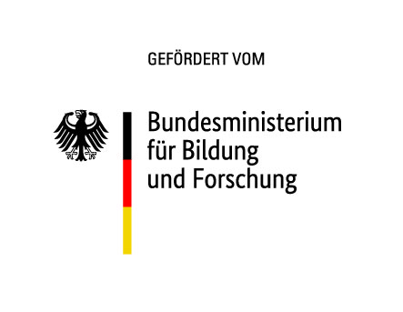

<div align="center">
    <a href="https://www.appfree.me/"></img></a>
</div>

</img>


### About Appfree
 ☎️ **A framework to provide smartphone-only services to the smartphone-less masses** ☎️

[TODO: kürzen und mehr auf die Technik eingehen]
Appfree is a framework allowing you to easily create Interactive Voice Response apps, e. g. apps which can be interacted with from a normal telephone or featurephone. It is based on a modern tech stack: PHP 8 and Laravel.

Are you feeling anxious when you notice you forgot your smartphone?
Are you feeling frustrated having to constantly update apps or having to reenter a password at the worst possible moment?

More and more things in daily life depend upon you having constant access to a charged, working smartphone with high speed data allowance.

Appfree is a project designed to relieve these feelings of frustration and anxiety and to deliver empowerment to everyday citizens.

Using appfree, you as a developer can create simple frontends for app only services which are normally usable only via a classic telephone or dumbphone.

The framework comes with a fully functional sample application for the city of Munich bike sharing service "MVG Rad", which is normally usable only via an Android/iOS app.  
With appfree, it is usable from every telephone.


### Project components

#### appfree-connector

Main repository for the appfree-connector. Contains the framework and application logic for IVR apps.

#### appfree-phone-server

Phone server backend providing connectivity to the phone network via Asterisk application. One instance of `appfree-phone-server` support connections by multiple appfree-app instances.

### Features

  - Basic framework for implementing IVR apps
  - MVG Rad sample app
  - (##todo)
[TODO]

### Installation 

See [Installation](/README-install.md)

#### Watchdog 

A watchdog process regularly tests if the app is still available to users and writes system log messages on error. It is part of the normal deploy process. Start it with 

```bash
systemctl --user start appfree-app-watchdog@{prod,staging,local}
```
 
### Architecture

See [architecture](./README-Architecture.md)

### MVG Rad example app

See [example app](./README-apps.md)

### License

[MIT License](./LICENSE.MD)

### Funding

This project was funded by the Prototype Fund of the German Federal Ministry of Education and Research (BMBF) and the Open Knowledge Foundation Germany.



